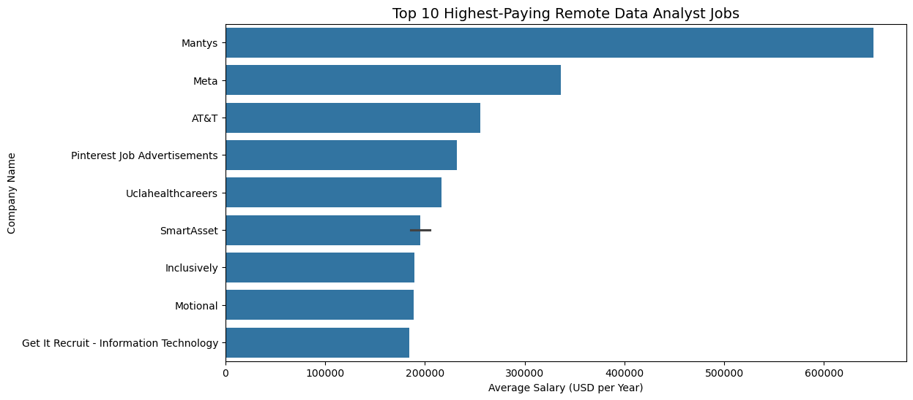
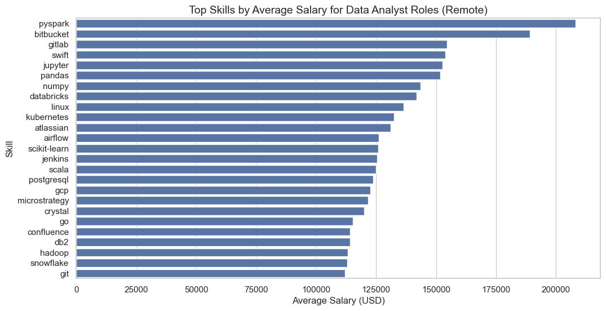
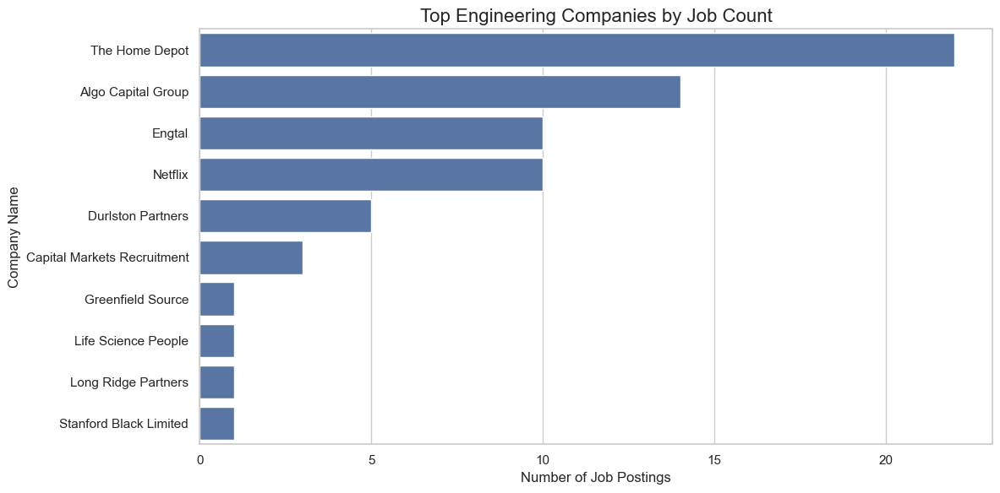
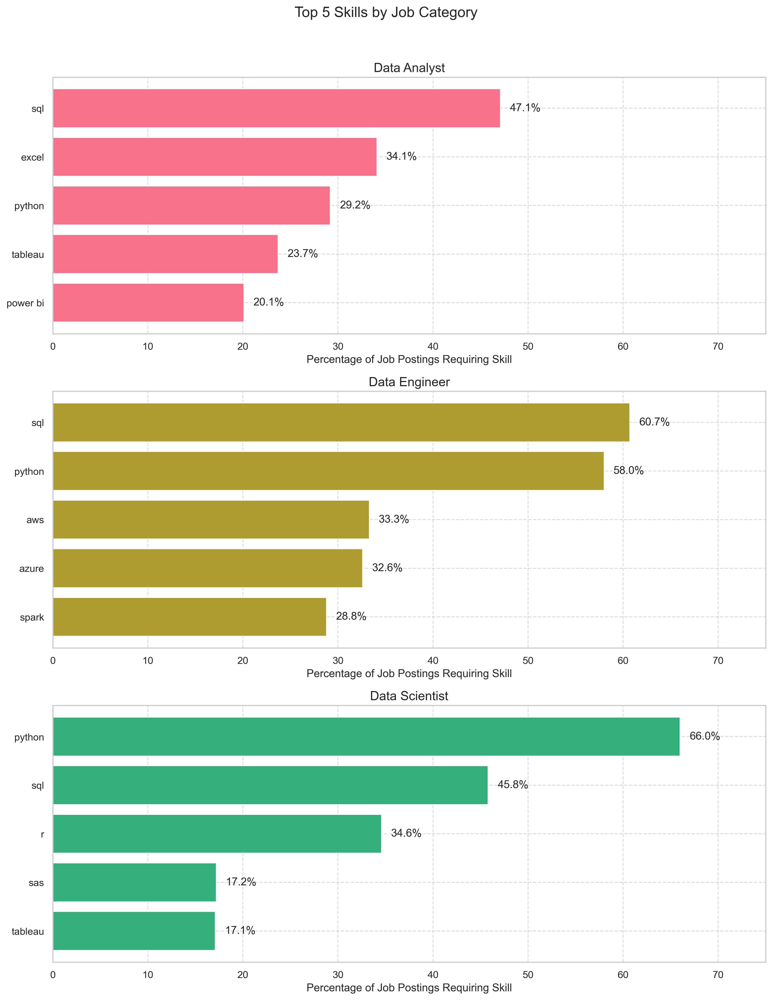

# 💼 Data Job Market Analysis

**Explore the landscape of data jobs — from top-paying Data Analyst roles to the most in-demand skills across the industry.**  
This project investigates job trends, salary benchmarks, and required skills using real-world job posting data.

## 📂 Project Structure
- **SQL queries:** [project_sql folder](/data_analysis/project_sql/)  
- **Visualizations:** Located in `assets/`, linked throughout this README  
- **Tools Used:** See below

---

## 🔧 Tools Used
To explore the job market for Data Analysts and related roles, I used:

- **SQL:** Core tool for querying data and uncovering insights.
- **PostgreSQL:** Reliable database management system for storing and querying job postings.
- **Visual Studio Code:** IDE for writing and running SQL scripts.
- **Git & GitHub:** Version control and collaboration tools for managing the project and sharing results.

---

## 🎯 Project Goals

The purpose of this project is to better understand:
- Which skills are most in demand for Data Analyst roles?
- What are the highest-paying opportunities?
- How does salary vary depending on required skills or company?

---

## 📊 Analysis

### 1. 🔝 Top Paying Data Analyst Jobs

**Question 1:**
- What are the 10 highest-paying remote Data Analyst roles?_  
This query filters for remote jobs, excludes postings without salary information, and aggregates required skills per role.

```sql
SELECT 
    j.job_id,
    j.job_title_short,
    c.name AS company_name,
    j.job_location,
    j.job_schedule_type,
    j.salary_year_avg,
    j.job_posted_date::DATE AS posting_date,  
    STRING_AGG(s.skills, ', ') AS required_skills  
FROM
    job_postings_fact AS j
LEFT JOIN company_dim AS c
    ON j.company_id = c.company_id
LEFT JOIN skills_job_dim AS sj
    ON j.job_id = sj.job_id
LEFT JOIN skills_dim AS s
    ON sj.skill_id = s.skill_id
WHERE
    j.job_title_short = 'Data Analyst' AND
    j.job_work_from_home = TRUE AND 
    j.salary_year_avg IS NOT NULL
GROUP BY
    j.job_id,
    j.job_title_short,
    c.name,
    j.job_location,
    j.job_schedule_type,
    j.salary_year_avg,
    j.job_posted_date
ORDER BY
    j.salary_year_avg DESC
LIMIT 10;
```




### 2. 💵 Salary Distribution by Skills (Data Analyst)

**Question 2:**
- What skills are associated with higher salaries for remote Data Analyst roles?
- This query calculates average salary per skill and filters out those with only 1 job listing.

```sql
SELECT 
    s.skills,
    COUNT(j.job_id) AS job_count,
    ROUND(AVG(j.salary_year_avg), 0) AS avg_salary
FROM
    job_postings_fact AS j
INNER JOIN skills_job_dim AS sj
    ON j.job_id = sj.job_id
INNER JOIN skills_dim AS s
    ON sj.skill_id = s.skill_id
WHERE
    j.job_title_short = 'Data Analyst' AND
    j.job_work_from_home = TRUE AND
    j.salary_year_avg IS NOT NULL
GROUP BY
    s.skills
HAVING
    COUNT(j.job_id) > 1  
ORDER BY
    avg_salary DESC
LIMIT 25;

```




### 3. 🏢 Top Paying Data Engineering Companies

**Question 3:**
- Which companies offer the highest average salaries for Data Engineer roles?
- This analysis first selects the top-paying companies, then filters for all jobs posted by those companies to evaluate 


```sql
WITH top_companies AS (
    SELECT 
        j.company_id,
        c.name AS company_name,
        ROUND(AVG(j.salary_year_avg), 0) AS avg_company_salary
    FROM 
        job_postings_fact AS j
    LEFT JOIN company_dim AS c 
        ON j.company_id = c.company_id
    WHERE 
        j.job_title_short = 'Data Engineer' 
        AND j.salary_year_avg IS NOT NULL
    GROUP BY 
        j.company_id, c.name
    ORDER BY 
        avg_company_salary DESC
    LIMIT 10
),

company_jobs AS (
    SELECT 
        j.job_id,
        j.company_id,
        tc.company_name,
        tc.avg_company_salary,  
        j.salary_year_avg AS individual_salary,
        j.job_location,
        j.job_work_from_home
    FROM 
        job_postings_fact AS j
    INNER JOIN top_companies AS tc 
        ON j.company_id = tc.company_id
    WHERE 
        j.salary_year_avg IS NOT NULL
)

SELECT 
    cj.company_name,
    cj.avg_company_salary,
    cj.job_location,
    cj.job_work_from_home,
    STRING_AGG(DISTINCT s.skills, ', ') AS required_skills,
    COUNT(DISTINCT cj.job_id) AS job_count
FROM 
    company_jobs AS cj
INNER JOIN skills_job_dim AS sj 
    ON cj.job_id = sj.job_id
INNER JOIN skills_dim AS s 
    ON sj.skill_id = s.skill_id
GROUP BY 
    cj.company_name, 
    cj.avg_company_salary, 
    cj.job_location, 
    cj.job_work_from_home
ORDER BY 
    cj.avg_company_salary DESC;
```



### 4. 📈 Top Skill Demand According to Each Job

**Question:**  
- What are the top 5 most frequently requested skills for Data Analysts, Data Scientists, and Data Engineers?
- This query calculates the frequency and relative percentage of each skill per job type and returns the top 5 for each category.

```sql
WITH job_category_counts AS (
    SELECT 
        job_title_short,
        COUNT(*) AS total_jobs
    FROM 
        job_postings_fact
    WHERE 
        job_title_short IN ('Data Engineer', 'Data Analyst', 'Data Scientist')
    GROUP BY 
        job_title_short
),

skills_by_job AS (
    SELECT 
        j.job_title_short,
        s.skills,
        COUNT(*) AS skill_count,
        jc.total_jobs,
        ROUND((COUNT(*) * 100.0 / jc.total_jobs), 1) AS skill_percentage,
        ROW_NUMBER() OVER (
            PARTITION BY j.job_title_short 
            ORDER BY COUNT(*) DESC
        ) AS skill_rank
    FROM 
        job_postings_fact j
    INNER JOIN skills_job_dim sj ON j.job_id = sj.job_id
    INNER JOIN skills_dim s ON sj.skill_id = s.skill_id
    INNER JOIN job_category_counts jc ON j.job_title_short = jc.job_title_short
    WHERE 
        j.job_title_short IN ('Data Engineer', 'Data Analyst', 'Data Scientist')
    GROUP BY 
        j.job_title_short, s.skills, jc.total_jobs
)

SELECT 
    job_title_short,
    skills,
    skill_count,
    total_jobs,
    skill_percentage
FROM 
    skills_by_job
WHERE 
    skill_rank <= 5
    AND skill_percentage >= 5  
ORDER BY 
    job_title_short,
    skill_percentage DESC;
```


---

### 🧠 What I Learned

Throughout this project, I gained valuable insights and practical experience in the following areas:

- **Advanced SQL Queries:**  
  Learned how to write complex SQL queries using `CTEs (WITH clauses)`, `JOINs`, `GROUP BY`, `HAVING`, and window functions like `ROW_NUMBER()` to analyze relational datasets effectively.

- **Data Cleaning & Filtering:**  
  Understood the importance of filtering out null or irrelevant data to ensure the accuracy of insights — for example, removing job postings without salary information.

- **Data Analysis in SQL:**  
  Developed skills in performing data analysis directly within SQL to uncover trends in salaries, job roles, and skill demand across different data careers.

- **Real-World Use of PostgreSQL:**  
  Gained hands-on experience working with a real-world PostgreSQL database, including schema exploration and joining multiple tables to extract meaningful information.

- **Insight Communication:**  
  Practiced transforming raw data into actionable insights — for example, identifying the top-paying remote data analyst jobs and the most in-demand skills for data professionals.

- **Version Control with Git & GitHub:**  
  Learned to track changes, structure a GitHub repository, and document work clearly using a `README.md` file.

- **Data Visualization Integration:**  
  Created visual representations of query results to make the findings easier to interpret and more impactful.

---

## 🧾 Conclusion

### 🔍 Insights by Question

- **1. Top Paying Data Analyst Jobs:**  
  We discovered that the highest-paying remote Data Analyst jobs are offered by reputable tech and finance companies, with salaries exceeding $150,000. These roles often list skills like SQL, Python, and Tableau — emphasizing the importance of combining data manipulation and visualization tools.

- **2. Skills Associated with Higher Salaries:**  
  The skills most correlated with higher average salaries include machine learning, AWS, and Spark — indicating that Data Analysts with knowledge in cloud services and big data technologies are compensated at a premium.

- **3. Top Paying Data Engineering Companies:**  
  Companies such as Capital One, Walmart, and other enterprise-level firms offer some of the most competitive salaries for Data Engineering roles. These roles require skills like Python, AWS, and Airflow, showing a demand for ETL pipeline experience and cloud-based tools.

- **4. Top Skill Demand by Job Title:**  
  While tools like SQL and Python are common across all data roles, each career path has its unique in-demand skills:
  - **Data Analyst:** Excel, Tableau, and SQL dominate.
  - **Data Scientist:** Python, Machine Learning, and Pandas are top priorities.
  - **Data Engineer:** Tools like AWS, Spark, and Airflow are heavily requested.

---

### 💭 Closing Thoughts

This project gave me a clearer picture of what companies are looking for in data roles today. It highlighted how essential it is to tailor your skill set based on your target role — whether it's diving deeper into cloud architecture for engineering, honing analytical tools for analyst positions, or advancing machine learning capabilities for science roles.

By using only SQL, I was able to draw meaningful insights directly from raw data, without needing any external data processing tools. This reinforced how powerful and versatile SQL is in real-world analytics work.

I’m excited to continue refining my data skills and expanding into areas like Python, dashboarding tools (e.g., Power BI, Tableau), and machine learning in future projects.
